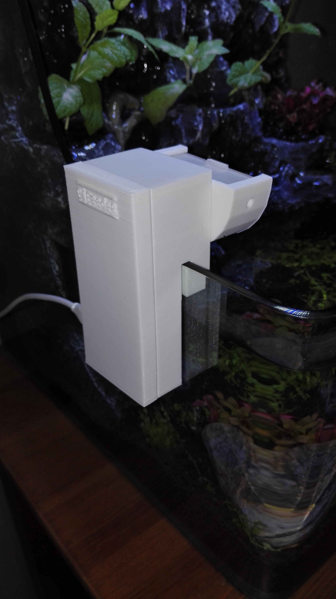
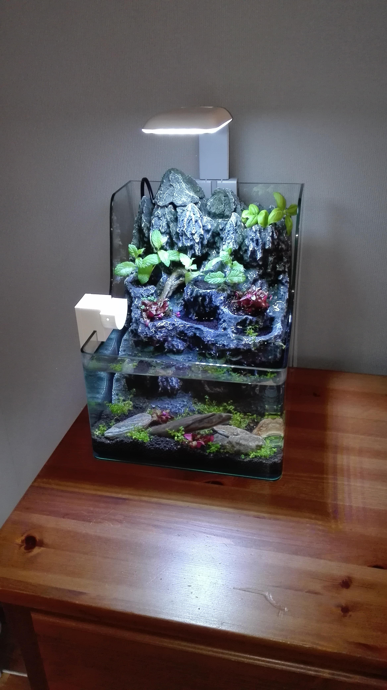
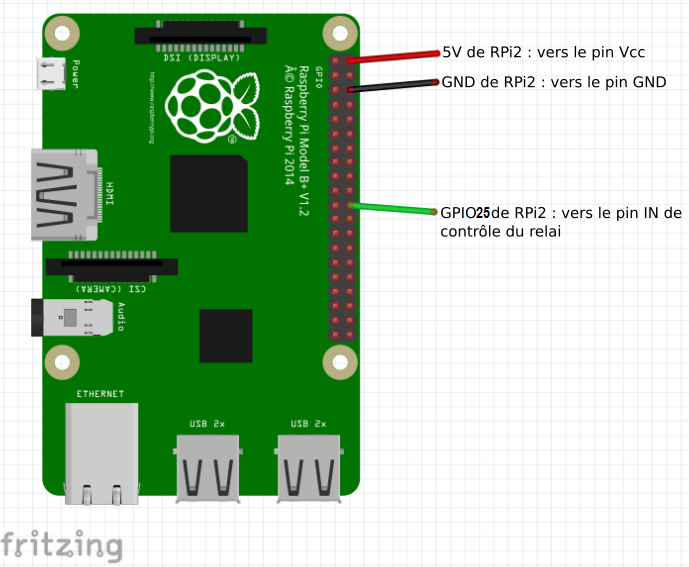

# PiFeeder (for fish) Project
 
Description:  
 
Projet de distributeur de nourriture automatique pour poisson, orienté Nano-Aquarium. 
Pourquoi me direz-vous? Car ceux du commerce ne correspondaient pas à ce que je recherchais: 
 
-Ils sont trop gros pour un nano. 
-Donnent de trop grosse portions (pour la plupart). 
-Sont moches. 
-Sont fait pour les vacances (ne correspondent pas forcément à un usage journalier. Oui je suis aquariophile mais surtout fainéant...) 
 
J'ai donc décidé d'en faire un petit et discret, capable de nourrir mes poissons toute l'année et qui est capable 
de donner de toutes petites portions. 
 

 
Pour cela j'utilise: 

 # 1 Raspberry Pi Zer0      (8€)   
 # 1 ServoMoteur SG90       (2€)   
 # 1 Dongle USB WIFI petit  (2€)   
 # 1 impression 3D PLA      (9€)   
 # _______________________________  
 # Total:                  ~ 21€ 
 
  
 L'appli sera développée en Java avec Reslet et AngularJs avec une IHM en SemanticUI. 
 (Ne commencez pas à critiquer mes choix ou bien créez votre propre projet Nerds!) 
 
 Commençons:
 
### Partie mécanique
======
Imprimez ou faites imprimer le boitier; Pour cela je vous fournir le .stl qui correspond à mon distributeur. 
 
Si toutefois votre aquarium était plus grand, la vitre plus épaisse ou que la contenance de mon distributeur est trop petite pour vos  
besoins, je vous ai mis le fickier .skp sketchup, vous n'avez plus qu'à adapter. 
 
Visez le ServoMoteur à son emplacement, et brancher les 3 fils au Raspberry comme suit: 

> la masse sur une masse du GPIO

> le + sur un +5v du GPIO

> le port controle sur le GPIO25

 
